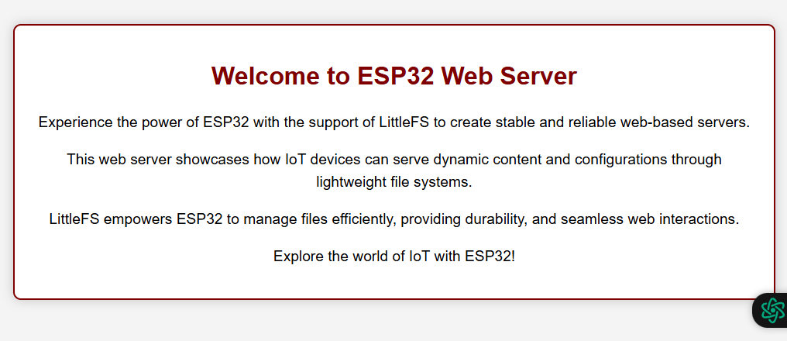

# ESP32 LittleFS Web Server Setup

## Project Description
This project demonstrates how to set up an ESP32 Web Server using LittleFS to serve HTML pages and store configuration files.

## Project Structure
```
📁 esp32_littlefs_web_server  
 ├── `esp32_littlefs_web_server.ino` (Main Arduino code)  
 ├── 📁 `data`           (Folder for extra files)  
 │   ├── `index.html`    (HTML file for Web Page)  
 │   └── `config.json`   (Configuration file with env. variables)  
```

## Setup Guide

### 1. Install the Arduino ESP8266/ESP32FS Plugin
The ESP8266FS or ESP32FS tool is needed to upload files to the SPIFFS or LittleFS filesystem.

#### Download the Plugin:
- For ESP8266: Download from [here](https://github.com/esp8266/arduino-esp8266fs-plugin/releases).
- For ESP32: Download from [here](https://github.com/me-no-dev/arduino-esp32fs-plugin/releases).

#### Install the Plugin:
Navigate to your Arduino IDE installation folder:
- **Windows:** `C:\Users\<YourUsername>\Documents\Arduino\tools`
- **Linux:** `~/Arduino/tools`
- **Mac:** `/Users/<YourUsername>/Documents/Arduino/tools`

Create the following folder structure if it doesn't exist:

```
tools/ESP32FS/tool/
```

Extract the downloaded ZIP file into the `tools` folder.

Restart Arduino IDE.

### 2. How to Upload Files

- Place your `index.html` and `config.json` inside the `data` folder.
- Uploading Files to LittleFS (Arduino IDE 2.x)

Arduino IDE 2.x does not support the ESP32 Sketch Data Upload Tool directly. However, you can upload files manually using the **ESP32 LittleFS Filesystem Upload Plugin**.

Follow this guide to set up and upload files:  
[How to Upload Files to ESP32 LittleFS Using Arduino IDE 2.x](https://randomnerdtutorials.com/arduino-ide-2-install-esp32-littlefs/)

#### Upload the Files:
1. Upload the code to your ESP32.
2. Open the **Serial Monitor** at `115200` baud rate.
3. Note the ESP32's IP address printed in the Serial Monitor.
4. Access the web page by navigating to:
   - HTML Page: `http://<ESP32_IP>/`
   - JSON File: `http://<ESP32_IP>/config`

### Output:
 - `http://<ESP32_IP>/` → Displays the HTML page.  
 - `http://<ESP32_IP>/config` → Returns the JSON configuration file.

### Sample Web Page Image

Below is a sample image of the loaded ESP32 web server:


